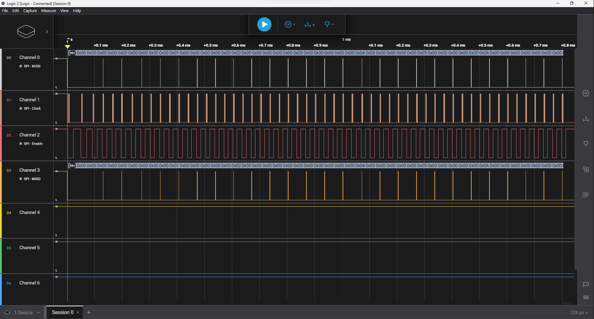
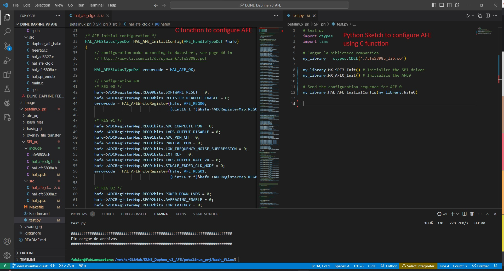
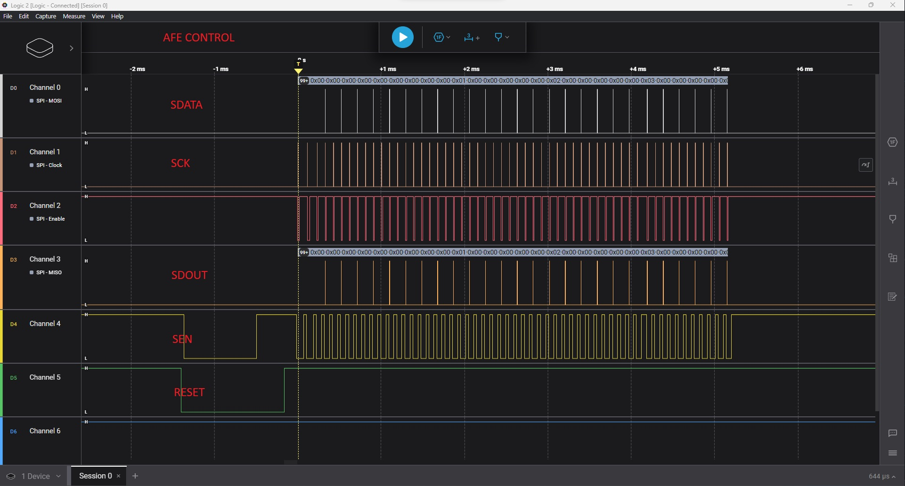
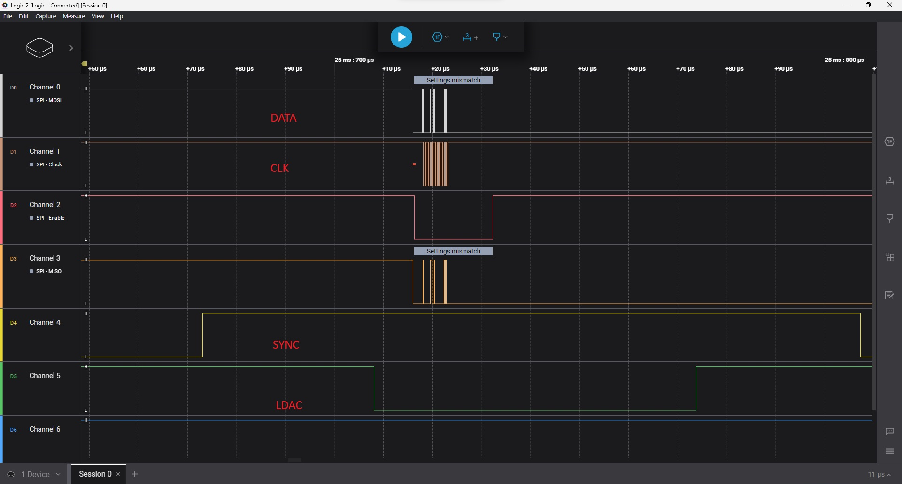

# Use of AFE5808A in PetaLinux

To list the functions in the library use `nm -D afe5808a_lib.so`

To avoid upload error **Command \r not found**, use `sed -i 's/\r$//' UploadFiles.sh`

Control of additional pins

